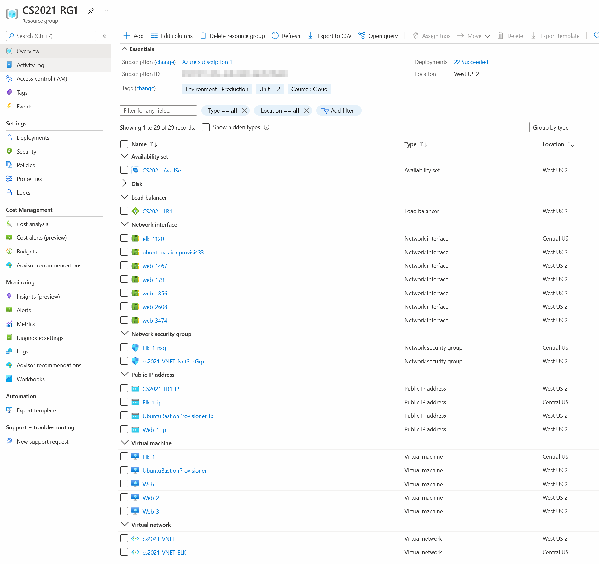

# CS2021-ELK-Stack 
> This project automates the installation and configuration of an ELK stack deployment on an Ubuntu 18.04 server. In this setup, there are a total of 5 Ubuntu 18.04 servers running on Azure. One server runs the ELK stack, one server is a bastion host with Ansible running in a Docker container, and the remaining three are web servers, running DVWA,  are used as an example on how to collect and monitor system resources and various log files. 

## Architecture Diagram

## Architecture Overview
The main reason for this setup of 5 Ubuntu servers on the Azure platform is to have an environment that a Cybersecurity student can use to quickly deploy various servers and services which include:
1. three (3) DVWA web servers configured behind an HTTP load balancer with restricted public access

2. one (1) publicly-accessible SSH bastion server (jumpbox) that serves as a central management server for accessing and administering all the other servers on an internal network

3. one (1) publicly-accessible ELK server through HTTP that will collect and monitor system resources and logs of the three DVWA web servers

## Azure Setup
Since this was my first time using Azure, the network and server set up was done using the GUI. I include screenshots of the important components, but, in a nutshell, these are the steps taken to setup the environment shown in the diagram.

1. **Register** for a **free Azure account**
 
- 30 day trial with 200$ credit and limit of 4 VMs per region

2. **Create** an **Azure Resource Group** to contain all related components of this project

- virtual machines, networks, load balancers, security groups

3. **Create 2 virtual networks**; one in West US 2, the other in Central US

- assign IP subnets for the servers

4. **Create one Ubuntu bastion server** with static IP

- install docker and configure it to run persistently
- install image, cyberxsecurity/ansible
- enter ansible image and generate root rsa pub/priv key pair

5. **Create three Ubuntu servers using ansible** public key and same user name on all three web servers

6. **Create one Ubuntu ELK server** with static IP

7. **Install and configure DVWA and ELK** on web and ELK servers **using Ansible** playbooks

8. **Verify DVWA and ELK work** through browser

### Azure Images
The images below visually represents all of the components needed to set up the servers (hardware, disks, ram, cpu, etc) and network components (subnets, firewalls, , network interfaces, load balancers, etc) required for this architecture. 

***The following points relate to the images below.***
1. The Azure Resource Group, CS2021_RG1, is a logical container that groups together related resources. Tags were added at this level in order to clearly identify resources that are related and to aid in properly associating costs to the right project or customer should you wish to group resources separately.
2. The virtual machines listed here are named according to their purpose and are placed in the appropriate location and with the minimum required hardware specs to fulfill its role.
3. The two network security groups shown here include the main one used for the web servers and SSH bastion server and the other one for the ELK server.
4. A virtual network peering connection is needed in order for resources in different locations (aka regions) to communicate to and from each location.
5. A load balancer was created to distribute the HTTP traffic amongst the three web servers. A backend pool was configured and is what receives the public IP address which can be configured to resolve using a DNS A or CNAME record (e.g. www.hackme.com)
#### 1. Azure Resource Group Items

#### 2. Azure Virtual Machines

#### 3. Azure Network Security Groups

#### 4. Azure Virtual Networks Peering Setup

#### 5. Azure Load Balancer Backend Pool 

## Security Access Policies
Azure Network Security Group rules are used to filter network traffic to and from Azure resources from external and internal locations. The rules act as the first line of defense that aims to filter traffic from trusted and untrusted sources. The following table describes the rules shown in the images in the **Azure Network Security Groups** section [up above](https://github.com/jiniguezjr/cs2021-elk-stack#3-azure-network-security-groups) and the numbers next to the lines in the image in the **Architecture Diagram** section [here](https://github.com/jiniguezjr/cs2021-elk-stack#architecture-diagram)
| Network Security Group  | Rule Priority | Line Number | Comments     |
| :---:                   |    :----:     | :---:       | :---        |
| cs2021-VNET-NetSecGrp   | 899           | 1           | allow inbound HTTP (TCP port 80) requests to the load balancer from my home IP address    |
| cs2021-VNET-NetSecGrp   | 900           | 2,3         | allow inbound SSH (TCP port 22) requests to the bastion server from my home IP address   |
| cs2021-VNET-NetSecGrp   | 910           | n/a         | allow all inbound requests (any protocol and port) from the bastion server to the 3 web servers  |
| cs2021-VNET-NetSecGrp   | 65000         | n/a         | allow all inbound requests (any protocol and port) from any on virtual network to any on virtual network  |
| cs2021-VNET-NetSecGrp   | 65001         | n/a         | allow all inbound requests (any protocol and port) from the load balancer to any on virtual network  |
| cs2021-VNET-NetSecGrp   | 65500         | n/a         | deny all inbound requests (any protocol and port) from any to any   |
| Elk-1-nsg               | 300           | 3           | allow inbound SSH (TCP port 22) requests from home and bastion server to any on virtual network    |
| Elk-1-nsg               | 310           | 3           | allow inbound HTTP (TCP port 5601) requests from home and bastion server to any on virtual network    |
| Elk-1-nsg               | 65000         | n/a         | allow all inbound requests (any protocol and port) from any on virtual network to any on virtual network  |
| Elk-1-nsg               | 65001         | n/a         | allow all inbound requests (any protocol and port) from the load balancer to any on virtual network  |
| Elk-1-nsg               | 65500         | n/a         | deny all inbound requests (any protocol and port) from any to any   |

## Ansible Provisioner 
The Ubuntu server created in this architecture is solely meant to operate a docker container with Ansible which is used as a central point to deploy infrastructure-as-code configuration sets to web and elk servers. Deployment is done using SSH and a passphrase-less RSA key-pair created under the root user in the Ansible container. The web and elk servers were built using the public key from the Ansible root user and is the only means of connecting to the servers to ensure that there is no manual installation and configuration of applications and system settings on the servers in this architecture. Refer to the [**Architecture Diagram**](https://github.com/jiniguezjr/cs2021-elk-stack#architecture-diagram) as a visual aid.
### Ease of Administration
*create ssh config file for easy connectivity*

    jinig@UbuntuBastionProvisioner:~$ touch ~/.ssh/config && chmod -v 0600 ~/.ssh/config
    mode of '/home/jinig/.ssh/config' retained as 0600 (rw-------)
    jinig@UbuntuBastionProvisioner:~$ cat .ssh/config
    # Created 3/10/21
    Host web1
            HostName 10.0.0.9
            User jinig
            IdentityFile ~/.ssh/id_rsa
    # Created 3/10/21
    Host web2
            HostName 10.0.0.7
            User jinig
            IdentityFile ~/.ssh/id_rsa
    # Created 3/17/21
    Host web3
            HostName 10.0.0.8
            User jinig
            IdentityFile ~/.ssh/id_rsa
    # Created 3/20/21
    Host elk1 elk-1
            HostName 10.2.0.4
            User jinig
            IdentityFile ~/.ssh/id_rsa

*verify ssh connectivity*

    jinig@UbuntuBastionProvisioner:~$ for host in `grep HostName .ssh/config | awk '{print $2}'` ; do ssh jinig@${host} 'hostname;whoami;uptime' ; done
    Web-1
    jinig
    03:52:00 up  3:09,  0 users,  load average: 0.00, 0.01, 0.00
    Web-2
    jinig
    03:52:01 up  3:09,  0 users,  load average: 0.00, 0.04, 0.01
    Web-3
    jinig
    03:52:02 up  3:09,  0 users,  load average: 0.02, 0.07, 0.03
    Elk-1
    jinig
    03:52:04 up  3:09,  0 users,  load average: 0.09, 0.05, 0.02

### Ansible Docker Setup
    apt install docker.io
    systemctl enable docker
    systemctl start docker
    systemctl status docker
    docker pull cyberxsecurity/ansible

### Connecting to Ansible
    docker container list -a
    docker start goofy_mendeleev
    docker attach goofy_mendeleev

### Ansible Configuration

#### /etc/ansible/hosts

*inventory file with groups of like servers*

    root@633f48857065:~# cat /etc/ansible/hosts | egrep -v '^#|^$'
    [webservers]
    10.0.0.7 ansible_python_interpreter=/usr/bin/python3
    10.0.0.8 ansible_python_interpreter=/usr/bin/python3
    10.0.0.9 ansible_python_interpreter=/usr/bin/python3
    [elkservers]
    10.2.0.4 ansible_python_interpreter=/usr/bin/python3

#### /etc/ansible/ansible.cfg

*main ansible configuration with global settings*

    root@633f48857065:~# cat /etc/ansible/ansible.cfg | egrep -v '^#|^$'
    [defaults]
    remote_user = jinig
    log_path = /var/log/ansible.log
    module_name = command
    [inventory]
    [privilege_escalation]
    [paramiko_connection]
    [ssh_connection]
    [persistent_connection]
    [accelerate]
    [selinux]
    [colors]
    [diff]

#### Testing Ansible Connectivity

    root@633f48857065:~# ansible webservers -m ping
    10.0.0.8 | SUCCESS => {
        "changed": false,
        "ping": "pong"
    }
    10.0.0.9 | SUCCESS => {
        "changed": false,
        "ping": "pong"
    }
    10.0.0.7 | SUCCESS => {
        "changed": false,
        "ping": "pong"
    }
    root@633f48857065:~# ansible elkservers -m ping
    10.2.0.4 | SUCCESS => {
        "changed": false,
        "ping": "pong"
    }

## DVWA Server Setup
The Damn Vulnerable Web Application is used by cybersecurity professionals to test their skills in detecting common vulnerabilities and protecting against them. We use [this Ansible playbook](/Files/dvwa-playbook.yml) to deploy a docker image to our 3 web servers.
### Install DVWA using Ansible

    root@633f48857065:/etc/ansible# ansible-playbook roles/dvwa-playbook.yml

    PLAY [Config Web VM with Docker] ****************************************************************************************************************************************************

    TASK [Gathering Facts] **************************************************************************************************************************************************************
    ok: [10.0.0.8]
    ok: [10.0.0.7]
    ok: [10.0.0.9]

    TASK [docker.io] ********************************************************************************************************************************************************************
    ok: [10.0.0.8]
    ok: [10.0.0.9]
    ok: [10.0.0.7]

    TASK [Install pip3] *****************************************************************************************************************************************************************
    ok: [10.0.0.7]
    ok: [10.0.0.8]
    ok: [10.0.0.9]

    TASK [Install Docker python module] *************************************************************************************************************************************************
    ok: [10.0.0.8]
    ok: [10.0.0.9]
    ok: [10.0.0.7]

    TASK [download and launch a docker web container] ***********************************************************************************************************************************
    ok: [10.0.0.7]
    ok: [10.0.0.8]
    ok: [10.0.0.9]

    TASK [Enable docker service] ********************************************************************************************************************************************************
    ok: [10.0.0.7]
    ok: [10.0.0.9]
    ok: [10.0.0.8]

    PLAY RECAP **************************************************************************************************************************************************************************
    10.0.0.7                   : ok=6    changed=0    unreachable=0    failed=0    skipped=0    rescued=0    ignored=0
    10.0.0.8                   : ok=6    changed=0    unreachable=0    failed=0    skipped=0    rescued=0    ignored=0
    10.0.0.9                   : ok=6    changed=0    unreachable=0    failed=0    skipped=0    rescued=0    ignored=0
### Verify DVWA is functioning
*access each DVWA server individually (i.e. with only 1 server online at a time) using the load balancer public IP*

## ELK Server Setup
*"ELK" is the acronym for three open source projects: Elasticsearch, Logstash, and Kibana. Elasticsearch is a search and analytics engine. Logstash is a server‑side data processing pipeline that ingests data from multiple sources simultaneously, transforms it, and then sends it to a "stash" like Elasticsearch. Kibana lets users visualize data with charts and graphs in Elasticsearch.* [source: https://elastic.co/what-is/elk-stack] (https://www.elastic.co/what-is/elk-stack)

### Install ELK using Ansible
    root@633f48857065:/etc/ansible# ansible-playbook --check roles/elk-playbook.yml

    PLAY [Config Web VM with Docker] ****************************************************************************************************************************************************
    TASK [Gathering Facts] **************************************************************************************************************************************************************
    ok: [10.2.0.4]

    TASK [Install docker.io] ************************************************************************************************************************************************************
    ok: [10.2.0.4]

    TASK [Install python-pip3] **********************************************************************************************************************************************************
    ok: [10.2.0.4]

    TASK [Install Docker python module] *************************************************************************************************************************************************
    ok: [10.2.0.4]

    TASK [Increase virtual memory] ******************************************************************************************************************************************************
    skipping: [10.2.0.4]

    TASK [Increase virtual memory on restart] *******************************************************************************************************************************************
    ok: [10.2.0.4]

    TASK [download and launch a docker elk container] ***********************************************************************************************************************************
    ok: [10.2.0.4]

    TASK [Enable docker service] ********************************************************************************************************************************************************
    ok: [10.2.0.4]

    PLAY RECAP **************************************************************************************************************************************************************************
    10.2.0.4                   : ok=7    changed=0    unreachable=0    failed=0    skipped=1    rescued=0    ignored=0

### Verify ELK is functioning
*access the ELK server by IP and port 5601*

### ELK + Beats Setup
Beats are *single-purpose data shippers* that send metrics from clients (in this case, the 3 DVWA servers) to the ELK server so that we can closely monitor the usage and health of the clients. The two minimum beats that a cybersecurity professional would want is [metricbeats](https://www.elastic.co/beats/metricbeat) and [filebeat](https://www.elastic.co/beats/filebeat). The former captures statistics about the system resources (e.g. ram, cpu, I/O, network), the later allows you to capture system and application logs for a closer watch on your systems for abnormal and suspicious patterns (i.e. invalid SSH attempts, hardware problems, etc).

**[metricbeat Ansible playbook](Files/metricbeat-playbook.yml)**

**[filebeat Ansible playbook](Files/filebeat-playbook.yml)**

#### Install metricbeat using Ansible

    root@633f48857065:/etc/ansible# ansible-playbook --check roles/metricbeat-playbook.yml

    PLAY [Install metric beat] **********************************************************************************************************************************************************

    TASK [Gathering Facts] **************************************************************************************************************************************************************
    ok: [10.0.0.8]
    ok: [10.0.0.7]
    ok: [10.0.0.9]

    TASK [Download metricbeat] **********************************************************************************************************************************************************
    skipping: [10.0.0.8]
    skipping: [10.0.0.7]
    skipping: [10.0.0.9]

    TASK [install metricbeat deb] *******************************************************************************************************************************************************
    skipping: [10.0.0.7]
    skipping: [10.0.0.8]
    skipping: [10.0.0.9]

    TASK [drop in metricbeat config] ****************************************************************************************************************************************************
    ok: [10.0.0.8]
    ok: [10.0.0.9]
    ok: [10.0.0.7]

    TASK [enable and configure docker module for metric beat] ***************************************************************************************************************************
    skipping: [10.0.0.8]
    skipping: [10.0.0.7]
    skipping: [10.0.0.9]

    TASK [setup metric beat] ************************************************************************************************************************************************************
    skipping: [10.0.0.7]
    skipping: [10.0.0.8]
    skipping: [10.0.0.9]

    TASK [start metric beat with service] ***********************************************************************************************************************************************
    skipping: [10.0.0.7]
    skipping: [10.0.0.8]
    skipping: [10.0.0.9]

    TASK [enable service metricbeat on boot] ********************************************************************************************************************************************
    ok: [10.0.0.8]
    ok: [10.0.0.7]
    ok: [10.0.0.9]

    PLAY RECAP **************************************************************************************************************************************************************************
    10.0.0.7                   : ok=3    changed=0    unreachable=0    failed=0    skipped=5    rescued=0    ignored=0
    10.0.0.8                   : ok=3    changed=0    unreachable=0    failed=0    skipped=5    rescued=0    ignored=0
    10.0.0.9                   : ok=3    changed=0    unreachable=0    failed=0    skipped=5    rescued=0    ignored=0

#### Install filebeat using Ansible

    root@633f48857065:/etc/ansible# ansible-playbook --check roles/filebeat-playbook.yml

    PLAY [installing and launching filebeat] ********************************************************************************************************************************************

    TASK [Gathering Facts] **************************************************************************************************************************************************************
    ok: [10.0.0.8]
    ok: [10.0.0.7]
    ok: [10.0.0.9]

    TASK [download filebeat deb] ********************************************************************************************************************************************************
    skipping: [10.0.0.8]
    skipping: [10.0.0.9]
    skipping: [10.0.0.7]

    TASK [install filebeat deb] *********************************************************************************************************************************************************
    skipping: [10.0.0.8]
    skipping: [10.0.0.7]
    skipping: [10.0.0.9]

    TASK [drop in filebeat.yml] *********************************************************************************************************************************************************
    ok: [10.0.0.8]
    ok: [10.0.0.9]
    ok: [10.0.0.7]

    TASK [enable and configure system module] *******************************************************************************************************************************************
    skipping: [10.0.0.7]
    skipping: [10.0.0.8]
    skipping: [10.0.0.9]

    TASK [setup filebeat] ***************************************************************************************************************************************************************
    skipping: [10.0.0.7]
    skipping: [10.0.0.8]
    skipping: [10.0.0.9]

    TASK [start filebeat service] *******************************************************************************************************************************************************
    skipping: [10.0.0.8]
    skipping: [10.0.0.7]
    skipping: [10.0.0.9]

    TASK [enable service filebeat on boot] **********************************************************************************************************************************************
    ok: [10.0.0.8]
    ok: [10.0.0.9]
    ok: [10.0.0.7]

    PLAY RECAP **************************************************************************************************************************************************************************
    10.0.0.7                   : ok=3    changed=0    unreachable=0    failed=0    skipped=5    rescued=0    ignored=0
    10.0.0.8                   : ok=3    changed=0    unreachable=0    failed=0    skipped=5    rescued=0    ignored=0
    10.0.0.9                   : ok=3    changed=0    unreachable=0    failed=0    skipped=5    rescued=0    ignored=0

### ELK GUI Beats Setup
The following images show the easy configuration steps necessary once you've installed the beats using Docker.

*Access ELK GUI to configure filebeat and metricbeat beats*

#### Configure filebeat to collect metrics

#### Configure metricbeat to collect metrics

### ELK Server Testing
The following images depict the filebeat and metricbeat beats working. 
- The first image shows a query of invalid SSH attempts to a DVWA server. 
- The second image is of the metricbeat beat summarizing the system resource usage.

## Author

I'm [Jesse Iniguez Jr](https://www.linkedin.com/in/jesseiniguez/), and I approve of this repository. :)
